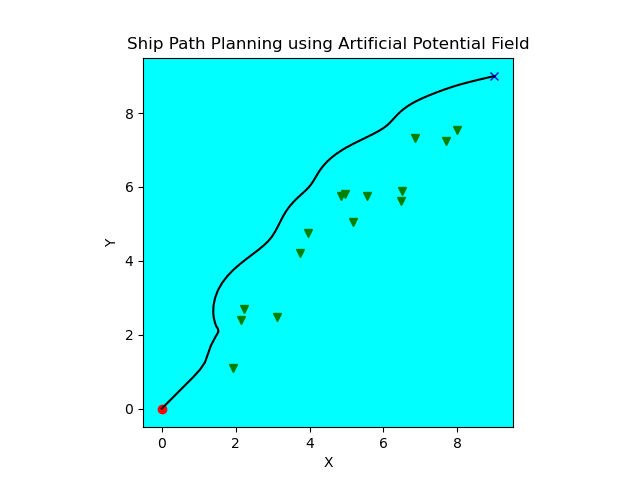

## 人工势场法概念

基本思想：在障碍物周围构建斥力势场，在目标点周围构建引力势场，被控对象在两种势场组成的复合场中受到斥力作用和引力作用，斥力和引力的合力指引着被控对象的运动，搜索无碰的避障路径

#### 引力势场
与目标点之间的距离有关，距离越大，汽车所受的势能就越大，距离越小，所受势能值就越小，所以引力势场的函数为：$$\mathrm{U_{att}\left(q\right)=\frac{1}{2}\eta\rho^{2}\left(q,q_{g}\right)}$$

其中 $\eta$ 为正比例增益系数, $\left(q,q_{g}\right)$ 为一个矢量, 表示汽车的位置$q$ 和目标点位置 $q_g$ 之间的欧式距离$|q-q_g|$, **矢量方向**是从汽车的位置指向目标点位置。

相应的引力 $F_{att}(q)$ 为引力场的负梯度,代表引力势场函数 $\mathrm{U_{att}\left(q\right)}$ 的变化最快方向。

$$\mathrm{F_{att}(q)=-\nabla U_{att}(q)=-\eta p(q,q_g)}$$

#### 斥力势场
决定障碍物斥力势场的因素是汽车与障碍物间的距离, 当汽车未进入障碍物的影响范围时, 其受到的势能值为零; 在汽车进入障碍物的影响范围后, 两者之间的距离越大, 汽车受到的势能值就越小, 距离越小, 汽车受到的势能值就越大,函数为：

$$U_{req}\left(X\right)=\begin{cases}\frac12k(\frac1{\rho(q,q_o)}-\frac1{\rho_o})^2&0\leq\rho(q,q_o)\leq\rho_o\\0&\rho(q,q_o)\geq\rho_o&\end{cases}$$

响应的斥力为斥力场的负梯度：
$$F_{req}\left(X\right)=\begin{cases}k(\frac1{\rho(q,q_0)}-\frac1{\rho_0})\frac1{\rho^2(q,q_0)}\nabla\rho(q,q_0)&0\leq\rho(q,q_0)\leq\rho_0\\0&\rho(q,q_0)\geq\rho_0&\end{cases}$$

#### 合力为：
$$ F = F_{att}(q) + F_{req}$$

#### 传统人工势场法算法的缺陷

1. 由于其规划的路径是依据有限的局部环境信息，缺乏全局环境上宏观自我调节能力，极易陷入局部最优；
2. 由于力的不平衡是机器人移动的主要因素，其极易在非目标点处达到力平衡，从而产生目标不可达现象；
3. 在障碍物之间的狭窄空间里，极易陷入徘徊抖动等不稳定状态， 产生震荡和死锁

#### 改进的斥力势场
1. 解决目标不可达的问题：
改变斥力场函数，传统的斥力场函数的大小由机器人与障碍物直接的距离决定，方向由障碍物指向机器人，为避免以上缺陷，我们可以把斥力场函数改为由两部分组成，第一部分像传统的斥力场函数一样由障碍物指向机器人，大小由机器人与障碍物之间距离和机器人与目标点距离共同决定，第二部分斥力由机器人指向目标点，大小由机器人与障碍物之间距离和机器人与目标点之间距离共同决定，斥力函数如下：
$$\begin{cases}F_{req1}=k(\frac1{\rho(q,q_o)}-\frac1{\rho_o})\frac{\rho_g^n}{\rho^2(q,q_o)}\\F_{req2}=\frac n2k(\frac1{\rho(q,q_o)}-\frac1{\rho_o})^2\rho_g^{n-1}&\end{cases}$$
其中$n$为任意常数，通过改进之后，当机器人到达目标点时斥力也变成了0

2. 针对陷入局部最小值问题的改进思路

   针对陷入局部极小值问题，可以引入随机的虚拟力使机器人跳出局部极小值的状态。在障碍物密集的情况下，机器人易陷入局部最小值，此时，也可以对密集的障碍物进行处理，将多个障碍物看出一个整体来求斥力。此外，也可以通过设置子目标点的方式来使机器人逃出极小值。

## 研究流程：
1. 绘制地图，一般用于地理信息可视化的软件主要是GMT、Matplotlib的basemap模块，和Matlab的M_map模块，
   - 安装Anaconda: https://blog.csdn.net/JineD/article/details/129507719，并建立虚拟环境命名为`path_planning`
   - 安装basemap模块：终端输入`conda install -c https://conda.anaconda.org/anaconda basemap `

2. 代码
   - 初始化参数
     - 船舶、目标点、障碍物的位置
     - 人工势场法参数：引力的增益系数，斥力的增益系数，障碍物对船舶产生作用的最大影响范围，改进的调节因子
     - 地图大小
   - 可视化界面
     - matplotlib.pyplot 
   - 人工势场法函数
     - 用改进的人工势场法，在传统人工势场法的障碍物斥力场模型中加入调节因子，船舶只有到达目标点时, 斥力和引力才同时减小到零,，防止目标不可达的问题和陷入局部最优的问题

有些场景达不到

## COLREG规则建立
1. 本船与他船构成对遇局面，采取向右转向避碰行动
    - 当他船的舷角为      $000°\leq\theta_\tau\leq005^\circ$
    - $|180^{\circ}-|\varphi_{T}-\varphi_{0}|\leq5^{\circ}$
    - $R_T\leq6$ n mile
    - $u_{T}=1$
2. 本船与他船构成交叉相遇局面，本船为让路船并采取 向右转向避碰行动
    - 当他船的舷角为     $000°\leq\theta_\tau\leq005^\circ$
    - $|180^{\circ}-|\varphi_{T}-\varphi_{0}||\ > 5^{\circ}$
    - $R_T\leq6$ n mile
    - $u_{T}=1$
3. 本船与他船构成交叉相遇局面，本船为让路船并采取 向右转向避碰行动
    - 当他船的舷角为     $005°\leq\theta_\tau\leq067.5^\circ$
    - $|180^{\circ}-|\varphi_{T}-\varphi_{0}||\ > 5^{\circ}$
    - $R_T\leq6$ n mile
    - $u_{T}=1$
4. 本船与他船构成交叉相遇局面，本船为让路船并采取 向左转向避碰行动
    - 当他船的舷角为     $067.5°\leq\theta_\tau\leq112.5^\circ$
    - $|180^{\circ}-|\varphi_{T}-\varphi_{0}||\ > 5^{\circ}$
    - $R_T\leq6$ n mile
    - $u_{T}=1$
5. 他船追越本船，本船为直航船，他船为让路船
    - 当他船的舷角为     $112.5°\leq\theta_\tau\leq247.5^\circ$

    - $R_T\leq3$ n mile
    - $u_{T}=1$
6. 本船与他船形成交叉相遇局面，他船为让路船，本船为直航船
    - 当他船的舷角为     $247.5°\leq\theta_\tau\leq335^\circ$
    - $|180^{\circ}-|\varphi_{T}-\varphi_{0}||\ > 5^{\circ}$
    - $R_T\leq6$ n mile
    - $u_{T}=1$
7. 本船与他船形成对遇局面， 本船采取向右转向的避碰行动
    - 当他船的舷角为     $355°\leq\theta_\tau\leq360^\circ$
    - $|180^{\circ}-|\varphi_{T}-\varphi_{0}||\ \leq 5^{\circ}$
    - $R_T\leq6$ n mile
    - $u_{T}=1$
8. 本船与他船形成交叉相遇局面，他船为让路船，并采取右转向的避碰行动
    - 当他船的舷角为     $247.5°\leq\theta_\tau\leq335^\circ$
    - $|180^{\circ}-|\varphi_{T}-\varphi_{0}||\ > 5^{\circ}$
    - $R_T\leq6$ n mile
    - $u_{T}=1$
9. 本船位于C区域追越他船，他船为直航船，本船为让路船并采取 向左转向避让行动
   - $|\varphi_0-\varphi_\tau|\le67.5$,
   - $112.5^{\circ}+\varphi_{\tau}\leq\alpha_{\tau}+180^{\circ}\leq180^{\circ}+\varphi_{\tau}($三项都为$\in[0^{\circ}~-360^{\circ}]$的数值)
   - $R_T\leq3$ n mile, 
   - $DCPA_0<0$
   - $u_{T}=1$
10. 本船位于C区域追越他船，他船为直航船，本船为让路船并采取 向右转向避让行动
   - $|\varphi_0-\varphi_\tau|\le67.5$,
   - $112.5^{\circ}+\varphi_{\tau}\leq\alpha_{\tau}+180^{\circ}\leq180^{\circ}+\varphi_{\tau}($三项都为$\in[0^{\circ}~-360^{\circ}]$的数值)
   - $R_T\leq3$ n mile, 
   - $DCPA_0\geq 0$
   - $u_{T}=1$
11. 本船位于C区域追越他船，他船为直航船且通过本船船尾，本船为让路船并采取 向左转向避让行动
   - $|\varphi_0-\varphi_\tau|\le67.5$,
   - $180^{\circ}+\varphi_{\tau}\leq\alpha_{\tau}+180^{\circ}\leq210^{\circ}+\varphi_{\tau}($三项都为$\in[0^{\circ}~-360^{\circ}]$的数值)
   - $R_T\leq3$ n mile, 
   - $DCPA_0<0$
   - $u_{T}=1$
12. 本船位于C区域追越他船，他船为直航船，本船为让路船并采取向右转向避让行动
   - $|\varphi_0-\varphi_\tau|\le67.5$,
   - $180^{\circ}+\varphi_{\tau}\leq\alpha_{\tau}+180^{\circ}\leq210^{\circ}+\varphi_{\tau}($三项都为$\in[0^{\circ}~-360^{\circ}]$的数值)
   - $R_T\leq3$ n mile, 
   - $DCPA_0\geq 0$
   - $u_{T}=1$
13. 本船位于D区域追越他船，他船为直航船且通过本船船首，本船为让路船并采取向右转向避让行动
   - $|\varphi_0-\varphi_\tau|\le67.5$,
   - $210^{\circ}+\varphi_{\tau}\leq\alpha_{\tau}+180^{\circ}\leq247.5^{\circ}+\varphi_{\tau}($三项都为$\in[0^{\circ}~-360^{\circ}]$的数值)
   - $R_T\leq3$ n mile, 
   - $DCPA_0> 0$
   - $u_{T}=1$
14. 本船位于D区域追越他船，他船为直航船且通过本船船首，本船为让路船并采取向左转向避让行动
   - $|\varphi_0-\varphi_\tau|\le67.5$,
   - $210^{\circ}+\varphi_{\tau}\leq\alpha_{\tau}+180^{\circ}\leq247.5^{\circ}+\varphi_{\tau}($三项都为$\in[0^{\circ}~-360^{\circ}]$的数值)
   - $R_T\leq3$ n mile, 
   - $DCPA_0\leq 0$
   - $u_{T}=1$

